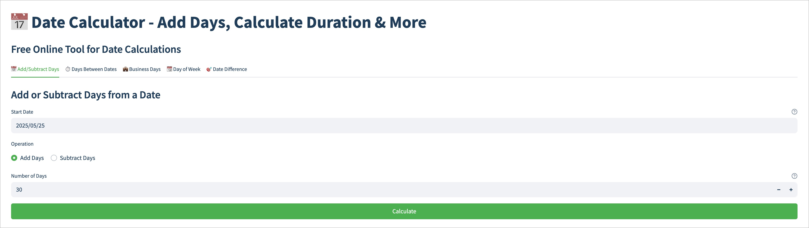

# Date Tools - Free Online Date Calculator

Welcome to **Date Tools**, a free online date calculator that helps you:

- Add or subtract days from any date.
- Calculate durations between two dates.
- Find business days, excluding weekends and holidays.
- Determine the day of the week for any date.
- Calculate exact time differences in years, months, weeks, days, hours, minutes, and seconds.

## Features

- **User-Friendly Interface**: Simple and intuitive design for quick calculations.
- **Accurate Results**: Handles leap years, different month lengths, and daylight saving time transitions.
- **Business Day Calculator**: Excludes weekends and optionally excludes US federal holidays.
- **Multiple Date Formats**: Displays results in various formats (e.g., ISO, international, short).
- **Fun Facts**: Provides interesting insights like total hours, minutes, and seconds.

## Live Demo

Access the app here: [Date Tools](https://datetools.streamlit.app)

## How to Use

1. **Add/Subtract Days**: Select a start date, choose an operation (add or subtract), and enter the number of days.
2. **Days Between Dates**: Select two dates to calculate the duration in days, months, and years.
3. **Business Days**: Calculate the number of working days between two dates, excluding weekends and holidays.
4. **Day of the Week**: Find out the day of the week for any given date.
5. **Exact Time Difference**: Calculate the precise time difference between two dates.

## SEO Optimizations

- **Meta Tags**: Optimized for search engines with descriptive titles, keywords, and social sharing images.
- **Structured Data**: Includes JSON-LD for rich snippets in search results.
- **Mobile-Friendly**: Fully responsive design for all devices.

## About the Creator

This app was created by [Erik Thiart](https://erikthiart.com/), a developer passionate about building tools that simplify everyday tasks.

## Feedback and Support

If you have any feedback or need support, feel free to reach out via [Twitter](https://twitter.com/intent/tweet?text=Check%20out%20this%20amazing%20Date%20Calculator!%20https://datetools.streamlit.app) or [LinkedIn](https://www.linkedin.com/sharing/share-offsite/?url=https://datetools.streamlit.app).

---

*Keywords: date calculator, add days, subtract days, business days, day of week, date difference, free online tool*
